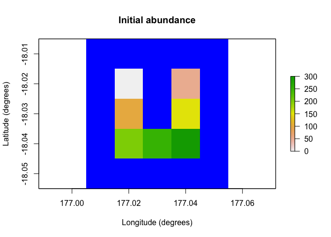

<!-- README.md is generated from README.Rmd. Please edit that file -->

# poems: Pattern-oriented ensemble modeling system (for spatially explicit populations) 

<!-- badges: start -->

[](https://doi.org/10.1111/2041-210X.13720)
[](https://cran.r-project.org/package=poems)
[](https://app.codecov.io/gh/GlobalEcologyLab/poems?branch=main)
[](https://github.com/GlobalEcologyLab/poems/commits/main)
[](https://github.com/GlobalEcologyLab/poems/actions/workflows/R-CMD-check.yaml)
[](https://www.repostatus.org/#active)
<!-- badges: end -->

The poems package provides a framework of interoperable *R6* (Chang,
2020) classes for building ensembles of viable models via the
pattern-oriented modeling (POM) approach (Grimm et al., 2005).
Pattern-oriented modeling is a vigorous form of statistical validation
in which simulations and their parameter settings are summarized using
key metrics and converged toward multiple observed patterns, or targets.

The package provides a process-based population model related to the
functionality of RAMAS or Vortex, but in a free and open source format,
with high customizability. The package includes classes for
encapsulating and generating model parameters, and managing the POM
workflow. The workflow includes:

1.  Model setup including generated spatial layers and demographic
    population model parameters.
2.  Generating model parameters via Latin hypercube sampling (Iman &
    Conover, 1980).
3.  Running multiple sampled model simulations.
4.  Collating summary results metrics via user-defined functions.
5.  Validating and selecting an ensemble of models that best match known
    patterns.

By default, model validation and selection utilizes an approximate
Bayesian computation (ABC) approach (Beaumont et al., 2002) using the
*abc* package (Csillery et al., 2015). However, alternative user-defined
functionality could be employed.

The package includes a spatially explicit demographic population model
simulation engine, which incorporates default functionality for density
dependence, correlated environmental stochasticity, stage-based
transitions, and distance-based dispersal. The user may customize the
simulator by defining functionality for translocations, harvesting,
mortality, and other processes, as well as defining the sequence order
for the simulator processes. The framework could also be adapted for use
with other model simulators by utilizing its extendable (inheritable)
base classes.

## Installation

You can install poems from the CRAN repository:

``` r
install.packages("poems")
```

Or you can install the development version of poems from
[GitHub](https://github.com/) using:

``` r
# install.packages("devtools")
remotes::install_github("GlobalEcologyLab/poems")
```

## The poemsverse

`poems` can do spatial population models on its own, but it also
provides the engine behind two extension packages:
[paleopop](https://github.com/GlobalEcologyLab/paleopop) and
[epizootic](https://github.com/viralemergence/epizootic). `paleopop` is
an extension for simulating populations over very long timescales, and
`epizootic` is an extension for simulating disease dynamics in wild
populations.

## Example

The following simple example demonstrates how to run a single spatially
explicit demographic population model using *poems*:

``` r
library(poems)

# Demonstration example region (U Island) and initial abundance
coordinates <- data.frame(
  x = rep(seq(177.01, 177.05, 0.01), 5),
  y = rep(seq(-18.01, -18.05, -0.01), each = 5)
)
template_raster <- Region$new(coordinates = coordinates)$region_raster # full extent
template_raster[][-c(7, 9, 12, 14, 17:19)] <- NA # make U Island
region <- Region$new(template_raster = template_raster)
initial_abundance <- seq(0, 300, 50)
raster::plot(region$raster_from_values(initial_abundance),
  main = "Initial abundance", xlab = "Longitude (degrees)",
  ylab = "Latitude (degrees)", zlim = c(0, 300), colNA = "blue"
)
```



``` r

# Set population model
pop_model <- PopulationModel$new(
  region = region,
  time_steps = 5,
  populations = 7,
  initial_abundance = initial_abundance,
  stage_matrix = matrix(c(
    0, 2.5, # Leslie/Lefkovitch matrix
    0.8, 0.5
  ), nrow = 2, ncol = 2, byrow = TRUE),
  carrying_capacity = rep(200, 7),
  density_dependence = "logistic",
  dispersal = (!diag(nrow = 7, ncol = 7)) * 0.05,
  result_stages = c(1, 2)
)

# Run single simulation
results <- population_simulator(pop_model)
results # examine
#> $all
#> $all$abundance
#> [1] 1010 1077 1229 1288 1405
#> 
#> $all$abundance_stages
#> $all$abundance_stages[[1]]
#> [1] 604 615 761 744 841
#> 
#> $all$abundance_stages[[2]]
#> [1] 406 462 468 544 564
#> 
#> 
#> 
#> $abundance
#>      [,1] [,2] [,3] [,4] [,5]
#> [1,]   50   91  143  174  204
#> [2,]   91  139  167  190  204
#> [3,]  126  136  162  201  196
#> [4,]  161  159  175  195  193
#> [5,]  185  181  182  170  202
#> [6,]  195  189  195  174  198
#> [7,]  202  182  205  184  208
#> 
#> $abundance_stages
#> $abundance_stages[[1]]
#>      [,1] [,2] [,3] [,4] [,5]
#> [1,]   33   54   90  107  134
#> [2,]   56   83  100  113  126
#> [3,]   64   79   98  111  103
#> [4,]  102   82  110  115  114
#> [5,]  100  113  109  103  118
#> [6,]  125  107  118   88  126
#> [7,]  124   97  136  107  120
#> 
#> $abundance_stages[[2]]
#>      [,1] [,2] [,3] [,4] [,5]
#> [1,]   17   37   53   67   70
#> [2,]   35   56   67   77   78
#> [3,]   62   57   64   90   93
#> [4,]   59   77   65   80   79
#> [5,]   85   68   73   67   84
#> [6,]   70   82   77   86   72
#> [7,]   78   85   69   77   88
raster::plot(region$raster_from_values(results$abundance[, 5]),
  main = "Final abundance", xlab = "Longitude (degrees)",
  ylab = "Latitude (degrees)", zlim = c(0, 300), colNA = "blue"
)
```


Further examples utilizing the POM workflow and more advanced features
of *poems* can be found in the accompanying vignettes.

## Citation

You may cite poems in publications using our software paper in *Methods
in Ecology and Evolution*:

Fordham, D. A., Haythorne, S., Brown, S. C., Buettel, J. C., & Brook, B.
W. (2021). poems: R package for simulating species’ range dynamics using
pattern‐oriented validation. *Methods in Ecology and Evolution*,
*12*(12), 2364-2371.

## References

Beaumont, M. A., Zhang, W., & Balding, D. J. (2002). ‘Approximate
Bayesian computation in population genetics’. *Genetics*, vol. 162, no.
4, pp, 2025–2035. <doi:10.1093/genetics/162.4.2025>

Chang, W. (2020). ‘R6: Encapsulated Classes with Reference Semantics’.
*R package version 2.5.0*. Retrieved from
<https://CRAN.R-project.org/package=R6>

Csillery, K., Lemaire L., Francois O., & Blum M. (2015). ‘abc: Tools for
Approximate Bayesian Computation (ABC)’. *R package version 2.1*.
Retrieved from <https://CRAN.R-project.org/package=abc>

Grimm, V., Revilla, E., Berger, U., Jeltsch, F., Mooij, W. M.,
Railsback, S. F., Thulke, H. H., Weiner, J., Wiegand, T., DeAngelis, D.
L., (2005). ‘Pattern-Oriented Modeling of Agent-Based Complex Systems:
Lessons from Ecology’. *Science* vol. 310, no. 5750, pp. 987–991.
<doi:10.1126/science.1116681>

Iman R. L., Conover W. J. (1980). ‘Small sample sensitivity analysis
techniques for computer models, with an application to risk assessment’.
*Commun Stat Theor Methods* A9, pp. 1749–1842.
<doi:10.1080/03610928008827996>
