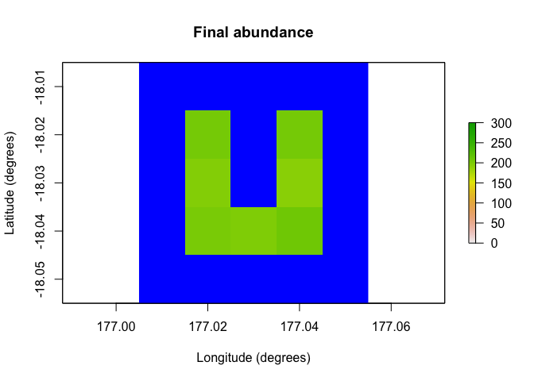

<!-- README.md is generated from README.Rmd. Please edit that file -->

# poems: Pattern-oriented ensemble modeling system (for spatially explicit populations)

<!-- badges: start -->

[](https://doi.org/10.1111/2041-210X.13720)
[](https://app.codecov.io/gh/GlobalEcologyLab/poems?branch=main)
[](https://github.com/GlobalEcologyLab/poems/commits/main)
[](https://github.com/GlobalEcologyLab/poems/actions/workflows/R-CMD-check.yaml)
<!-- badges: end -->

The poems package provides a framework of interoperable *R6* (Chang,
2020) classes for building ensembles of viable models via the
pattern-oriented modeling (POM) approach (Grimm et al., 2005). The
package includes classes for encapsulating and generating model
parameters, and managing the POM workflow. The workflow includes:

1.  Model setup including generated spatial layers and demographic
    population model parameters.
2.  Generating model parameters via Latin hypercube sampling (Iman &
    Conover, 1980).
3.  Running multiple sampled model simulations.
4.  Collating summary results metrics via user-defined functions.
5.  Validating and selecting an ensemble of models that best match known
    patterns.

By default, model validation and selection utilizes an approximate
Bayesian computation (ABC) approach (Beaumont et al., 2002) using the
*abc* package (Csillery et al., 2015). However, alternative user-defined
functionality could be employed.

The package includes a spatially explicit demographic population model
simulation engine, which incorporates default functionality for density
dependence, correlated environmental stochasticity, stage-based
transitions, and distance-based dispersal. The user may customize the
simulator by defining functionality for trans-locations, harvesting,
mortality, and other processes, as well as defining the sequence order
for the simulator processes. The framework could also be adapted for use
with other model simulators by utilizing its extendable (inheritable)
base classes.

## Installation

You can install the released version of poems from
[CRAN](https://CRAN.R-project.org) with:

``` r
install.packages("poems")
```

And the development version from [GitHub](https://github.com/) with:

``` r
# install.packages("devtools")
devtools::install_github("GlobalEcologyLab/poems")
```

## Example

The following simple example demonstrates how to run a single spatially
explicit demographic population model using *poems*:

``` r
library(poems)

# Demonstration example region (U Island) and initial abundance
coordinates <- data.frame(x = rep(seq(177.01, 177.05, 0.01), 5),
                          y = rep(seq(-18.01, -18.05, -0.01), each = 5))
template_raster <- Region$new(coordinates = coordinates)$region_raster # full extent
template_raster[][-c(7, 9, 12, 14, 17:19)] <- NA # make U Island
region <- Region$new(template_raster = template_raster)
initial_abundance <- seq(0, 300, 50)
raster::plot(region$raster_from_values(initial_abundance), 
             main = "Initial abundance", xlab = "Longitude (degrees)", 
             ylab = "Latitude (degrees)", zlim = c(0, 300), colNA = "blue")
```


``` r

# Set population model
pop_model <- PopulationModel$new(
  region = region,
  time_steps = 5,
  populations = 7,
  initial_abundance = initial_abundance,
  stage_matrix = matrix(c(0, 2.5, # Leslie/Lefkovitch matrix
                          0.8, 0.5), nrow = 2, ncol = 2, byrow = TRUE),
  carrying_capacity = rep(200, 7),
  density_dependence = "logistic",
  dispersal = (!diag(nrow = 7, ncol = 7))*0.05,
  result_stages = c(1, 2))

# Run single simulation
results <- population_simulator(pop_model)
results # examine
#> $all
#> $all$abundance
#> [1] 1072 1145 1194 1294 1299
#> 
#> $all$abundance_stages
#> $all$abundance_stages[[1]]
#> [1] 646 718 693 794 742
#> 
#> $all$abundance_stages[[2]]
#> [1] 426 427 501 500 557
#> 
#> 
#> 
#> $abundance
#>      [,1] [,2] [,3] [,4] [,5]
#> [1,]   45   95  109  151  164
#> [2,]  102  141  169  192  184
#> [3,]  141  190  185  212  209
#> [4,]  155  148  175  153  177
#> [5,]  186  169  165  200  193
#> [6,]  227  206  194  199  191
#> [7,]  216  196  197  187  181
#> 
#> $abundance_stages
#> $abundance_stages[[1]]
#>      [,1] [,2] [,3] [,4] [,5]
#> [1,]   28   62   62   92   99
#> [2,]   55   96   95  123  103
#> [3,]   77  110  118  134  124
#> [4,]  104   79  117   96   95
#> [5,]  114  107   80  117  106
#> [6,]  140  136  110  125  103
#> [7,]  128  128  111  107  112
#> 
#> $abundance_stages[[2]]
#>      [,1] [,2] [,3] [,4] [,5]
#> [1,]   17   33   47   59   65
#> [2,]   47   45   74   69   81
#> [3,]   64   80   67   78   85
#> [4,]   51   69   58   57   82
#> [5,]   72   62   85   83   87
#> [6,]   87   70   84   74   88
#> [7,]   88   68   86   80   69
raster::plot(region$raster_from_values(results$abundance[,5]),
             main = "Final abundance", xlab = "Longitude (degrees)", 
             ylab = "Latitude (degrees)", zlim = c(0, 300), colNA = "blue")
```



Further examples utilizing the POM workflow and more advanced features
of *poems* can be found in the accompanying vignettes.

## References

Beaumont, M. A., Zhang, W., & Balding, D. J. (2002). ‘Approximate
Bayesian computation in population genetics’. *Genetics*, vol. 162, no.
4, pp, 2025–2035. <doi:10.1093/genetics/162.4.2025>

Chang, W. (2020). ‘R6: Encapsulated Classes with Reference Semantics’.
*R package version 2.5.0*. Retrieved from
<https://CRAN.R-project.org/package=R6>

Csillery, K., Lemaire L., Francois O., & Blum M. (2015). ‘abc: Tools for
Approximate Bayesian Computation (ABC)’. *R package version 2.1*.
Retrieved from <https://CRAN.R-project.org/package=abc>

Grimm, V., Revilla, E., Berger, U., Jeltsch, F., Mooij, W. M.,
Railsback, S. F., Thulke, H. H., Weiner, J., Wiegand, T., DeAngelis, D.
L., (2005). ‘Pattern-Oriented Modeling of Agent-Based Complex Systems:
Lessons from Ecology’. *Science* vol. 310, no. 5750, pp. 987–991.
<doi:10.1126/science.1116681>

Iman R. L., Conover W. J. (1980). ‘Small sample sensitivity analysis
techniques for computer models, with an application to risk assessment’.
*Commun Stat Theor Methods* A9, pp. 1749–1842.
<doi:10.1080/03610928008827996>
