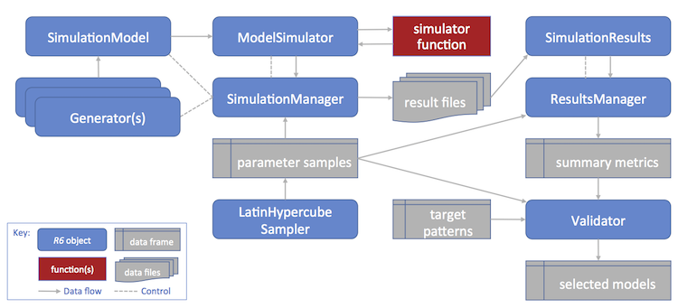

# poems: Pattern-oriented ensemble modeling and simulation

The *poems* package provides a framework of interoperable
[`R6`](https://r6.r-lib.org/reference/R6Class.html) classes for building
ensembles of viable models via the pattern-oriented modeling (POM)
approach (Grimm et al., 2005). The package includes classes for
encapsulating and generating model parameters, and managing the POM
workflow. The workflow includes: model setup; generating model
parameters via Latin hypercube sampling; running multiple sampled model
simulations; collating summary results; and validating and selecting an
ensemble of models that best match known patterns. By default, model
validation and selection utilizes an approximate Bayesian computation
(ABC) approach (Beaumont, Zhang, & Balding, 2002), although alternative
user-defined functionality could be employed. The package also includes
a spatially explicit demographic population model simulation engine,
which includes default functionality for density dependence, correlated
environmental stochasticity, stage-based transitions, and distance-based
dispersal. The user may customize the simulator by defining
functionality for translocations, harvesting, mortality, and other
processes, as well as defining the sequence order for the simulator
processes. The framework could also be adapted for use with other model
simulators by utilizing its extendable (inheritable) base classes.

## Framework and workflow

The *poems* framework utilizes a hierarchy of extendable (inheritable)
[`R6`](https://r6.r-lib.org/reference/R6Class.html) class objects that
work together to manage a POM workflow for building an ensemble of
simulation models. 

1.  Create a simulation model template (a
    [`SimulationModel`](https://globalecologylab.github.io/poems/reference/SimulationModel.md)
    or inherited class object) with appropriate fixed parameters for the
    study domain. Also define a study region via the
    [`Region`](https://globalecologylab.github.io/poems/reference/Region.md)
    class if the simulations are to be spatially explicit.

2.  Create generators
    ([`Generator`](https://globalecologylab.github.io/poems/reference/Generator.md)
    or inherited class objects) for dynamically generating
    (non-singular) model parameters represented by data structures, such
    as arrays or lists.

3.  Generate a data frame of sampled variable model parameters using the
    [`LatinHypercubeSampler`](https://globalecologylab.github.io/poems/reference/LatinHypercubeSampler.md).
    This will include singular model parameter values as well as input
    parameters for the generators.

4.  Create a
    [`SimulationManager`](https://globalecologylab.github.io/poems/reference/SimulationManager.md)
    object configured with the simulation model (template), the
    generators, and the sample parameter data frame. Running this
    manager sets and runs the models via the simulator function for each
    set (row) of sampled parameters, utilising the generators when
    required. The results of each model simulation run are written to a
    file. A simulation log file is also created.

5.  Create a
    [`ResultsManager`](https://globalecologylab.github.io/poems/reference/ResultsManager.md)
    object configured with the sample parameter data and result file
    details. Running this manager constructs a data frame of configured
    summary metrics, one row for each simulation result file. The
    manager utilizes the
    [`SimulationResults`](https://globalecologylab.github.io/poems/reference/SimulationResults.md)
    (or inherited) class to encapsulate, and dynamically generate
    additional derived, results. The metrics are generated via
    user-defined specifications and functions for calculating each
    metric from the results (objects).

6.  Create a
    [`Validator`](https://globalecologylab.github.io/poems/reference/Validator.md)
    object configured with the sample parameter data, summary metrics,
    and target (observed) pattern values for each metric. By default,
    the validator utilizes an approximate Bayesian computation (ABC)
    validation method via the
    [`abc`](https://rdrr.io/pkg/abc/man/abc.html) library, although the
    validator (call) function can be configured to utilize other library
    or user-defined functions. Running the validator (with appropriate
    call function configuration) produces an ensemble of models (indices
    to sampled parameters) that were found to best match the targets.
    Diagnostic outputs may also be produced (depending on the call
    function and its configuration).

7.  The selected models may then be utilized for further studies, such
    as alternative model scenarios or counterfactuals. This can be
    achieved by utilizing the selected subset of parameter samples to
    form inputs for further model simulations (by repeating the steps
    above).

## Population modeling components

- [`population_simulator`](https://globalecologylab.github.io/poems/reference/population_simulator.md)
  function: The simulation engine's main function processes the model
  input parameters, controls the flow, calling other function modules as
  required, and returns the results of each simulation.

- [`population_density`](https://globalecologylab.github.io/poems/reference/population_density.md)
  function: Module for configuring and performing density dependence
  calculations at each simulation time step. A user-defined function may
  be utilized.

- [`population_env_stoch`](https://globalecologylab.github.io/poems/reference/population_env_stoch.md)
  function: Module for configuring and stochastically applying
  environmental variability to stage-based population transition rates
  at each simulation time step.

- [`population_transitions`](https://globalecologylab.github.io/poems/reference/population_transitions.md)
  function: Module for configuring and performing stage-based
  demographic transitions of population abundances at each simulation
  time step.

- [`population_transformation`](https://globalecologylab.github.io/poems/reference/population_transformation.md)
  function: Module for configuring and performing user-defined
  transformations to staged population abundances. This functionality is
  utilized when defining functions for `translocation`, `harvest`,
  `mortality`, or other custom transformative functions.

- [`population_dispersal`](https://globalecologylab.github.io/poems/reference/population_dispersal.md)
  function: Module for configuring and performing dispersal calculations
  at each simulation time step. A user-defined function may be utilized.

- [`population_results`](https://globalecologylab.github.io/poems/reference/population_results.md)
  function: Module for configuring, initializing, and collating
  simulation results.

- [`PopulationModel`](https://globalecologylab.github.io/poems/reference/PopulationModel.md)
  class: Inherited from
  [`SimulationModel`](https://globalecologylab.github.io/poems/reference/SimulationModel.md),
  this class encapsulates the input parameters utilized by the
  [`population_simulator`](https://globalecologylab.github.io/poems/reference/population_simulator.md).

- [`SimulatorReference`](https://globalecologylab.github.io/poems/reference/SimulatorReference.md)
  class: This simple [`R6`](https://r6.r-lib.org/reference/R6Class.html)
  class enables user-defined functionality to maintain persistent
  (attached) attributes and to write to the simulator results.

- [`SpatialCorrelation`](https://globalecologylab.github.io/poems/reference/SpatialCorrelation.md)
  class: Provides functionality for generating parameters that can be
  utilized when optionally applying a spatial correlation within the
  simulator's environmental variability calculations.

- [`DispersalGenerator`](https://globalecologylab.github.io/poems/reference/DispersalGenerator.md)
  class: Inherited from
  [`Generator`](https://globalecologylab.github.io/poems/reference/Generator.md),
  this class provides functionality for generating distance-based
  dispersal parameters that can be utilized when performing dispersal
  calculations.

- [`DispersalFriction`](https://globalecologylab.github.io/poems/reference/DispersalFriction.md)
  class: Provides functionality for adjusting the (equivalent) distance
  between population cells given a spatio-temporal frictional landscape.
  These adjustments may be utilized by the
  [`DispersalGenerator`](https://globalecologylab.github.io/poems/reference/DispersalGenerator.md).

- [`PopulationResults`](https://globalecologylab.github.io/poems/reference/PopulationResults.md)
  class: Inherited from
  [`SimulationResults`](https://globalecologylab.github.io/poems/reference/SimulationResults.md),
  this class encapsulates the results generated by the
  [`population_simulator`](https://globalecologylab.github.io/poems/reference/population_simulator.md),
  as well as dynamically generating additional derived results.

## References

Beaumont, M. A., Zhang, W., & Balding, D. J. (2002). 'Approximate
Bayesian computation in population genetics'. *Genetics*, vol. 162, no.
4, pp, 2025–2035.

Grimm, V., Revilla, E., Berger, U., Jeltsch, F., Mooij, W. M.,
Railsback, S. F., Thulke, H. H., Weiner, J., Wiegand, T., DeAngelis, D.
L., (2005). 'Pattern-Oriented Modeling of Agent-Based Complex Systems:
Lessons from Ecology'. *Science* vol. 310, no. 5750, pp. 987–991.

## Examples

``` r
# Here we demonstrate building and running a simple population model. For a
# demonstration of the POM workflow with the model, see vignette("simple_example").

# Demonstration example region (U Island) and initial abundance
coordinates <- data.frame(
  x = rep(seq(177.01, 177.05, 0.01), 5),
  y = rep(seq(-18.01, -18.05, -0.01), each = 5)
)
template_raster <- Region$new(coordinates = coordinates)$region_raster # full extent
template_raster[][-c(7, 9, 12, 14, 17:19)] <- NA # make U Island
region <- Region$new(template_raster = template_raster)
initial_abundance <- seq(0, 300, 50)
raster::plot(region$raster_from_values(initial_abundance),
  main = "Initial abundance", xlab = "Longitude (degrees)",
  ylab = "Latitude (degrees)", zlim = c(0, 300), colNA = "blue"
)


# Set population model
pop_model <- PopulationModel$new(
  region = region,
  time_steps = 5,
  populations = 7,
  initial_abundance = initial_abundance,
  stage_matrix = matrix(c(
    0, 2.5, # Leslie/Lefkovitch matrix
    0.8, 0.5
  ), nrow = 2, ncol = 2, byrow = TRUE),
  carrying_capacity = rep(200, 7),
  density_dependence = "logistic",
  dispersal = (!diag(nrow = 7, ncol = 7)) * 0.05,
  result_stages = c(1, 2)
)

# Run single simulation
results <- population_simulator(pop_model)
results # examine
#> $all
#> $all$abundance
#> [1]  997 1073 1243 1311 1354
#> 
#> $all$abundance_stages
#> $all$abundance_stages[[1]]
#> [1] 606 628 734 774 814
#> 
#> $all$abundance_stages[[2]]
#> [1] 391 445 509 537 540
#> 
#> 
#> 
#> $abundance
#>      [,1] [,2] [,3] [,4] [,5]
#> [1,]   38   78  132  171  181
#> [2,]  105  162  187  185  186
#> [3,]  143  169  179  207  213
#> [4,]  165  172  178  194  200
#> [5,]  175  160  181  185  221
#> [6,]  185  160  192  170  174
#> [7,]  186  172  194  199  179
#> 
#> $abundance_stages
#> $abundance_stages[[1]]
#>      [,1] [,2] [,3] [,4] [,5]
#> [1,]   27   36   82  106  107
#> [2,]   57   97  116  110  100
#> [3,]   81  111   92  126  132
#> [4,]   92  104  105  108  123
#> [5,]  107   94  111   97  140
#> [6,]  125   87  125  100  109
#> [7,]  117   99  103  127  103
#> 
#> $abundance_stages[[2]]
#>      [,1] [,2] [,3] [,4] [,5]
#> [1,]   11   42   50   65   74
#> [2,]   48   65   71   75   86
#> [3,]   62   58   87   81   81
#> [4,]   73   68   73   86   77
#> [5,]   68   66   70   88   81
#> [6,]   60   73   67   70   65
#> [7,]   69   73   91   72   76
#> 
#> 
raster::plot(region$raster_from_values(results$abundance[, 5]),
  main = "Final abundance", xlab = "Longitude (degrees)",
  ylab = "Latitude (degrees)", zlim = c(0, 300), colNA = "blue"
)

```
