In this vignette we present a simple example of the *poems* workflow to
show how to use a custom `translocation` function to introduce
populations at defined time steps. The vignette also shows how to define
different growth rates for populations in different regions.

Note that the examples are for a single stage matrix model.

## Setup

As before, We begin by loading the necessary packages.


``` r
library(poems)
library(raster)
library(sf)
#> Linking to GEOS 3.13.0, GDAL 3.8.5, PROJ 9.5.1; sf_use_s2() is TRUE
library(scales)
library(stringi) # for randomly generating file names.

# function to round to any arbitrary value
round_any <- function(x, accuracy, f = round) {
  f(x / accuracy) * accuracy
}
```

\newpage

## Step 1: Build the population model for the study region

Create a model template using the *PopulationModel* class. This model is
spatially explicit, so is defined using the *Region* class. In addition
we make the model **temporally** explicit so we can introduce
populations at defined time steps.

### Study region

First, we'll define our study region. For this example, we utilise a
`raster::RasterLayer()` of Thylacine habitat suitability.


``` r
# Region raster
data(tasmania_raster)
tasmania_raster
#> class      : RasterLayer 
#> dimensions : 32, 40, 1280  (nrow, ncol, ncell)
#> resolution : 0.1, 0.1  (x, y)
#> extent     : 144.5, 148.5, -43.8025, -40.6025  (xmin, xmax, ymin, ymax)
#> crs        : +proj=longlat +ellps=WGS84 +towgs84=0,0,0,0,0,0,0 +no_defs 
#> source     : memory
#> names      : layer 
#> values     : 1, 1  (min, max)

# Equal area projection
tasPrj <- 'PROJCS["Tasmania_Lambert_Azimuthal",
                 GEOGCS["GCS_WGS_1984",
                        DATUM["D_WGS_1984",
                              SPHEROID["WGS_1984",6378137.0,298.257223563]],
                        PRIMEM["Greenwich",0.0],
                        UNIT["Degree",0.0174532925199433]],
                 PROJECTION["Lambert_Azimuthal_Equal_Area"],
                 PARAMETER["False_Easting",0.0],
                 PARAMETER["False_Northing",0.0],
                 PARAMETER["Central_Meridian",147],
                 PARAMETER["Latitude_Of_Origin",-42.2],
                 UNIT["Meter",1.0]]'

# Template raster to project to
tempExt <- projectExtent(tasmania_raster, tasPrj)
res(tempExt) <- 10000 # 10 km resolution
tempExt
#> class      : RasterLayer 
#> dimensions : 36, 34, 1224  (nrow, ncol, ncell)
#> resolution : 10000, 10000  (x, y)
#> extent     : -211571.8, 128428.2, -182583.2, 177416.8  (xmin, xmax, ymin, ymax)
#> crs        : +proj=laea +lat_0=-42.2 +lon_0=147 +x_0=0 +y_0=0 +datum=WGS84 +units=m +no_defs

# Project the region
tasmania_raster <- projectRaster(tasmania_raster, tempExt,
  method = "ngb"
)
plot(tasmania_raster,
  main = "Tasmania raster",
  legend = FALSE,
  col = "#2E8B57", colNA = "grey75"
)
```

<div class="figure" style="text-align: center">
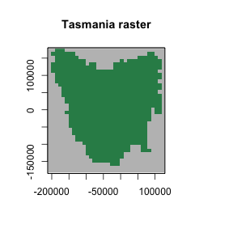
<p class="caption">plot of chunk unnamed-chunk-2</p>
</div>


\newpage

Now we can define our `poems::Region`:


``` r
# Tasmania study region (735 non-NA cells stored in the order shown) #
region <- Region$new(template_raster = tasmania_raster)
region$region_raster
#> class      : RasterLayer 
#> dimensions : 36, 34, 1224  (nrow, ncol, ncell)
#> resolution : 10000, 10000  (x, y)
#> extent     : -211571.8, 128428.2, -182583.2, 177416.8  (xmin, xmax, ymin, ymax)
#> crs        : +proj=laea +lat_0=-42.2 +lon_0=147 +x_0=0 +y_0=0 +datum=WGS84 +units=m +no_defs 
#> source     : memory
#> names      : layer 
#> values     : 1, 735  (min, max)

# Establish HS template and starting location #
# This will be our initial introduction point
int_ll <- sf_project(
  from = "EPSG:4326",
  to = tasPrj,
  pts = cbind(146.44, -41.18)
)
int_point <- region$region_indices[
  which(region$region_indices ==
    cellFromXY(tasmania_raster, xy = int_ll))
]

# row which corresponds to initial introduction site
int_index <- which(region$region_indices == int_point) # 114

# plot of region, and introduction locations
plot(region$region_raster,
  main = "Tasmanian study region (cell indices)",
  colNA = "grey75",
  addfun = function() {
    points(xyFromCell(region$region_raster, int_point), col = "red", pch = 16)
  }
)
```

<div class="figure" style="text-align: centre">
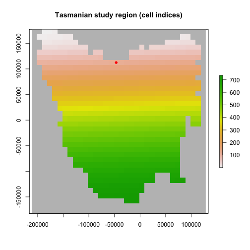
<p class="caption">plot of chunk unnamed-chunk-3</p>
</div>

### Land-use modifier

Here we read in a land-use modifier layer which we can use to make our
region spatiotemporally explicit. This has the effect of altering the HS
values through time which causes dynamic changes in habitat suitability,
and thus population abundances.

While we could change these values now and supply them as is to the
simulator. In this example, we will use a *Generator* object later on to
apply the HS scaling.


``` r
# read in the land-use modifier
data(tasmania_modifier)

plot(tasmania_modifier,
  zlim = c(0, 1), colNA = "grey75",
  col = hcl.colors(100, "RdYlGn")
)
```

<div class="figure" style="text-align: centre">
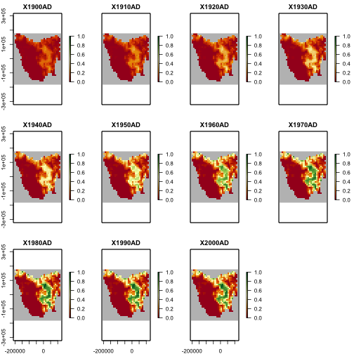
<p class="caption">plot of chunk unnamed-chunk-4</p>
</div>

``` r

# Habitat suitability
data(thylacine_hs_raster)
hs_raster <- projectRaster(thylacine_hs_raster, region$region_raster, method = "bilinear")
hs_raster <- stretch(hs_raster, minv = 0, maxv = 1)
hs_raster
#> class      : RasterLayer 
#> dimensions : 36, 34, 1224  (nrow, ncol, ncell)
#> resolution : 10000, 10000  (x, y)
#> extent     : -211571.8, 128428.2, -182583.2, 177416.8  (xmin, xmax, ymin, ymax)
#> crs        : +proj=laea +lat_0=-42.2 +lon_0=147 +x_0=0 +y_0=0 +datum=WGS84 +units=m +no_defs 
#> source     : memory
#> names      : layer 
#> values     : 0, 1  (min, max)

# initial_hs needed for generator
initial_hs <- hs_raster <- stack(replicate(n = nlayers(tasmania_modifier), hs_raster))
```

\newpage

While we have read in the land-use modifier, we have not applied it to
the HS values yet. This means that our HS values are still static as
shown by the plot below.


``` r
# static HS for the moment
## capacity generator will make it temporally dynamic
plot(hs_raster,
  zlim = c(0, 1), colNA = "grey75",
  col = hcl.colors(100, "RdYlGn"),
  addfun = function() {
    points(xyFromCell(region$region_raster, int_point), pch = 16, cex = 0.5)
  }
)
```

<div class="figure" style="text-align: centre">
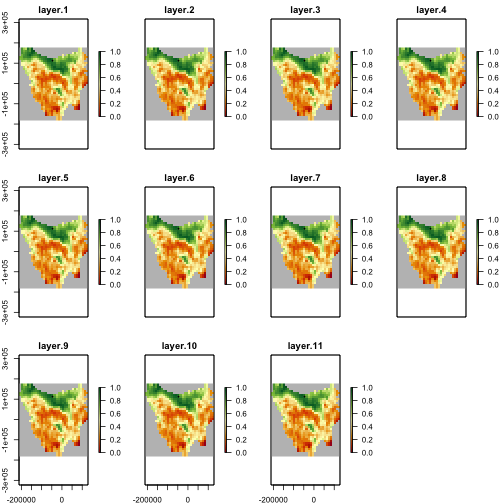
<p class="caption">plot of chunk unnamed-chunk-5</p>
</div>

\newpage

### Environmental correlation

Next, we'll define a distance-based spatial correlation for applying
environmental stochasticity within our model. The generated correlation
data is compacted for computational efficiency (with large-scale
models).


``` r
# Distance-based environmental correlation (via a compacted Cholesky decomposition)
env_corr <- SpatialCorrelation$new(
  region = region,
  amplitude = 0.496,
  breadth = 80,
  distance_scale = 1000
)
env_corr$calculate_compact_decomposition(decimals = 4)
```

### Spatially-varying growth rates

Here we use IBRA regions to define varying growth rates for different
populations. These could be expected to occur for example in a
wide-ranging species that occurs in varying habitats (e.g. red foxes in
Australia).


``` r
# allow growth rates to vary by region using IBRA regions
# Tasmania study Interim Bioregionalisation of Australia (IBRA) bioregion cell distribution
data(tasmania_ibra_raster)
ibra_raster <- projectRaster(tasmania_ibra_raster, region$region_raster, method = "ngb")
plot(ibra_raster,
  colNA = "grey75",
  breaks = seq(1, 9, 1),
  main = "IBRA regions of Tasmania",
  col = hcl.colors(10, "Lajolla")
)
```

<div class="figure" style="text-align: centre">
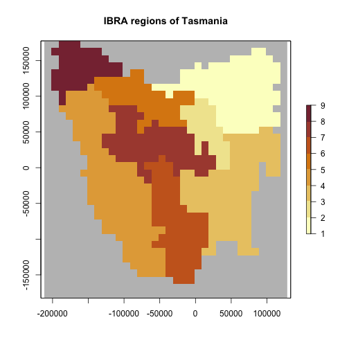
<p class="caption">plot of chunk unnamed-chunk-7</p>
</div>

``` r

data(tasmania_ibra_data)
tasmania_ibra_data
#>   index key abbr                        name
#> 1     1   A  FUR                    Furneaux
#> 2     2   B  BEN                  Ben Lomond
#> 3     3   C  TNM Tasmanian Northern Midlands
#> 4     4   D  TSE        Tasmanian South East
#> 5     5   E   TW              Tasmanian West
#> 6     6   F  TNS   Tasmanian Northern Slopes
#> 7     7   G  TSR   Tasmanian Southern Ranges
#> 8     8   H  TCH Tasmanian Central Highlands
#> 9     9   I  KIN                        King

# Calculate cell indices and counts for IBRA bioregions
ibra_indices <- lapply(
  as.list(tasmania_ibra_data$index),
  function(i) {
    which(ibra_raster[region$region_indices] == i)
  }
)
str(ibra_indices)
#> List of 9
#>  $ : int [1:50] 11 12 20 21 22 23 24 25 35 36 ...
#>  $ : int [1:68] 40 42 65 66 67 68 92 93 94 95 ...
#>  $ : int [1:37] 180 181 209 210 211 212 213 238 239 240 ...
#>  $ : int [1:131] 307 308 330 331 332 333 334 335 336 337 ...
#>  $ : int [1:166] 104 131 132 133 134 135 162 163 164 165 ...
#>  $ : int [1:59] 56 57 78 79 80 81 82 83 84 105 ...
#>  $ : int [1:88] 404 429 430 431 432 457 458 459 483 484 ...
#>  $ : int [1:87] 199 200 201 202 229 230 231 232 258 259 ...
#>  $ : int [1:49] 1 2 3 4 5 6 7 8 9 10 ...

ibra_polygons <- rasterToPolygons(ibra_raster, dissolve = TRUE, na.rm = TRUE)
ibra_polygons@data <- merge(ibra_polygons@data, tasmania_ibra_data,
  by.x = "layer", by.y = "index"
)
ibra_polygons
#> class       : SpatialPolygonsDataFrame 
#> features    : 9 
#> extent      : -201571.8, 118428.2, -162583.2, 177416.8  (xmin, xmax, ymin, ymax)
#> crs         : +proj=laea +lat_0=-42.2 +lon_0=147 +x_0=0 +y_0=0 +datum=WGS84 +units=m +no_defs 
#> variables   : 4
#> names       : layer, key, abbr,           name 
#> min values  :     1,   A,  BEN,     Ben Lomond 
#> max values  :     9,   I,   TW, Tasmanian West

plot(ibra_polygons, col = hcl.colors(9, "Lajolla"), border = "black")
text(ibra_polygons, labels = "abbr", cex = 1.2, halo = TRUE)
```

<div class="figure" style="text-align: centre">
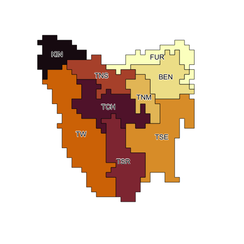
<p class="caption">plot of chunk unnamed-chunk-7</p>
</div>

``` r

rmax_regional <- ibra_raster

# seed is set to keep example results constant
{
  set.seed(27)
  rmax <- round(rlnorm(9, 0.94, 0.3), 1)
}
for (val in 1:9) {
  rmax_regional[rmax_regional == val] <- rmax[val]
}
plot(rmax_regional,
  colNA = "grey75",
  legend = FALSE, main = "regional growth rates",
  zlim = range(rmax),
  addfun = function() {
    plot(ibra_polygons,
      border = hcl.colors(9, "Lajolla"),
      col = NA, add = TRUE
    )
    text(ibra_polygons, labels = rmax, halo = TRUE)
  },
  col = hcl.colors(100, "Zissou")
)
```

<div class="figure" style="text-align: centre">
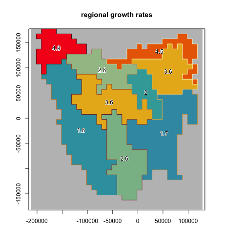
<p class="caption">plot of chunk unnamed-chunk-7</p>
</div>

``` r

# set upper and lower growth rates per region
ibra_rmax <- cbind(tasmania_ibra_data,
  rmax_lower = round(rmax * 0.6, 2),
  rmax_mean = round(rmax, 2),
  rmax_upper = round(rmax / 0.75, 2)
)
ibra_rmax
#>   index key abbr                        name rmax_lower rmax_mean rmax_upper
#> 1     1   A  FUR                    Furneaux       2.70       4.5       6.00
#> 2     2   B  BEN                  Ben Lomond       2.16       3.6       4.80
#> 3     3   C  TNM Tasmanian Northern Midlands       1.20       2.0       2.67
#> 4     4   D  TSE        Tasmanian South East       1.02       1.7       2.27
#> 5     5   E   TW              Tasmanian West       1.08       1.8       2.40
#> 6     6   F  TNS   Tasmanian Northern Slopes       1.68       2.8       3.73
#> 7     7   G  TSR   Tasmanian Southern Ranges       1.56       2.6       3.47
#> 8     8   H  TCH Tasmanian Central Highlands       2.16       3.6       4.80
#> 9     9   I  KIN                        King       2.94       4.9       6.53
```

\newpage

## Step 2: Setup the translocation function

Here we generate a custom *Translocation* class object. This object can
be used to translocate populations from one location to another, or as
shown here, to introduce populations at defined locations and timesteps.
The function could also be expanded to introduce varying number of
animals at each site. For simplicity sake, this example releases the
same number of animals at all locations.

### Introduction sites and times

Here we define the introduction sites by matching
`region$region_indices` to our introduction locations.

We also define the timesteps that the introductions should occur. These
timesteps are sequential from 1, and are not defined by, for example,
calendar years.


``` r
# set up translocation locations and order
intro_trans_ll <- sf_project(
  from = "EPSG:4326",
  to = tasPrj,
  pts = cbind(
    c(148.01, 144.7, 147.9, 148.27, 145.24),
    c(-40.8, -40.7, -43.2, -42.02, -42.3)
  )
)
intro_trans_ll
#>            [,1]       [,2]
#> [1,]   85234.38  154987.89
#> [2,] -194366.53  163999.33
#> [3,]   73150.82 -111470.77
#> [4,]  105182.23   19214.10
#> [5,] -145117.36  -12600.28
intro_trans_point <- region$region_indices[which(region$region_indices %in%
  cellFromXY(region$region_raster,
    xy = intro_trans_ll
  ))]
intro_trans_point <- intro_trans_point[-1]
intro_cells <- intro_trans_point
intro_cells
#> [1]  98 542 653 981

intro_times <- c(2, 3, 6, 8)

# Introduction times and locations
cbind(intro_times, intro_cells)
#>      intro_times intro_cells
#> [1,]           2          98
#> [2,]           3         542
#> [3,]           6         653
#> [4,]           8         981

plot(region$region_raster,
  main = "Introduction sites",
  col = hcl.colors(100, "Lajolla"),
  addfun = function() {
    plot(ibra_polygons, border = "black", col = NA, add = TRUE)
    points(xyFromCell(region$region_raster, intro_cells),
      pch = 16,
      cex = 1.5, col = c("darkgreen", "blue2", "black", "goldenrod")
    )
    points(region$coordinates[which(region$region_indices %in% intro_cells), ],
      col = "firebrick", cex = 1.5, lwd = 2
    )
  }
)
```

<div class="figure" style="text-align: centre">
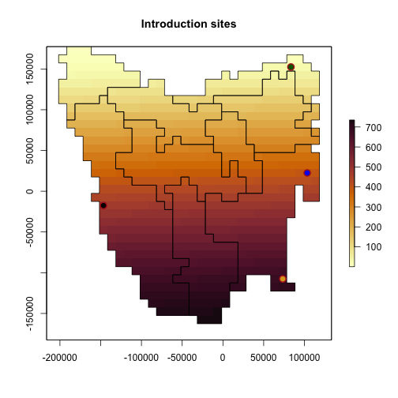
<p class="caption">plot of chunk unnamed-chunk-8</p>
</div>

\newpage

### Translocation function

Here we define the custom `translocation` function. It's simply a `list`
object, with a nested function that uses parameters from the model to
make changes to the simulated populations.


``` r
# User-defined translocation function (list-nested) and alias ####

translocation <- list(

  # Function parameters (passed to function in params list)
  intro_cells = intro_cells, # cells where pops are introduced
  intro_timesteps = intro_times, # timesteps when introduced
  trans_n = 50, # translocated abundances. If not provided by LHS == 50
  region_indices = region$region_indices,

  # Function definition
  translocation_function = function(params) {
    # Unpack parameters (used at every time step)
    intro_cells <- params$intro_cells
    intro_timesteps <- params$intro_timesteps
    simulator <- params$simulator
    stages <- params$stages
    populations <- params$populations
    abundances <- params$abundance
    region_indices <- params$region_indices
    tm <- params$tm # timestep
    sa <- params$stage_abundance
    trans_n <- params$trans_n
    # if introduction at timestep, introduce pops
    if (tm %in% intro_timesteps) {
      # take stage abundance at timestep
      new_sa <- array(sa, c(stages, populations))
      # identifies location of introduction
      trans_loc <- which(region_indices == intro_cells[which(intro_timesteps == tm)])
      # add n individuals regardless of K
      new_sa[trans_loc] <- new_sa[trans_loc] + trans_n
      return(new_sa)
    } else {
      # else return pops as they are
      new_sa <- array(sa, c(stages, populations))
      return(new_sa)
    }
  }
)
translocation_aliases <- list(
  intro_cells = "translocation$intro_cells",
  intro_times = "translocation$intro_timesteps",
  trans_n = "translocation$trans_n",
  region_indices = "translocation$region_indices"
)
```

\newpage

## Step 3: Build generators for dynamically generating model parameters

### Growth rate generator

Now we can build a *Generator* class object that will generate random
growth rates based on quantiles between the min and max in each IBRA
region. This allows us to sample across the range of values within each
region.


``` r
# Build a Rmax generator based on sampled IBRA Rmax range quantile
rmax_gen <- Generator$new(
  description = "Rmax",
  spatial_correlation = env_corr,
  generate_rasters = FALSE,
  ibra_data_rmax = ibra_rmax,
  ibra_indices = ibra_indices,
  region_cells = region$region_cells,
  inputs = c("rmax_quantile"),
  outputs = c("growth_rate_max"),
  generative_requirements = list(growth_rate_max = "function")
)

# growth_rate_max template
rmax_gen$add_function_template(
  "growth_rate_max",
  function_def = function(params) {
    growth_rate_max <- array(0, params$region_cells)
    for (i in 1:nrow(params$ibra_data_rmax)) {
      growth_rate_max[params$ibra_indices[[i]]] <-
        stats::qunif(params$rmax_quantile,
          min = params$ibra_data_rmax$rmax_lower[i],
          max = params$ibra_data_rmax$rmax_upper[i]
        )
    }
    return(growth_rate_max)
  },
  call_params = c("ibra_data_rmax", "ibra_indices", "region_cells", "rmax_quantile")
)

# test rmax generator at median values
rmax_gen_ex <- rmax_gen$generate(input_values = list(rmax_quantile = 0.5))
rmax_regional[region$region_indices] <- rmax_gen_ex$growth_rate_max
plot(rmax_regional,
  main = "median regional rmax",
  col = hcl.colors(100),
  addfun = function() {
    plot(ibra_polygons, border = "black", col = NA, add = TRUE)
  }
)
```

<div class="figure" style="text-align: centre">
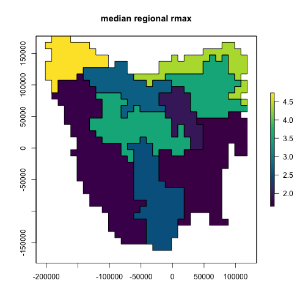
<p class="caption">plot of chunk unnamed-chunk-10</p>
</div>

The map above shows the result of sampling our possible *rmax* values to
their median values. The plot below shows that we can sample across a
range of values using the same generator. This functionality allows us
to pass `rmax_quantile` as a variable in a *LatinHypercubeSampler*
class.


``` r
# Test multiple quantiles
test_rmax <- lapply(seq(0, 1, 0.1), function(i) {
  region$raster_from_values(rmax_gen$generate(input_values = list(rmax_quantile = i))$growth_rate_max)
})
test_rmax <- stack(test_rmax)
names(test_rmax) <- paste0("Q", seq(0, 1, 0.1))

# plot
plot(test_rmax,
  colNA = "grey75",
  legend = TRUE,
  zlim = c(
    min(values(test_rmax), na.rm = TRUE),
    max(values(test_rmax), na.rm = TRUE)
  ),
  addfun = function() {
    plot(ibra_polygons, border = "black", col = NA, add = TRUE)
  },
  col = hcl.colors(100)
)
```

<div class="figure" style="text-align: centre">
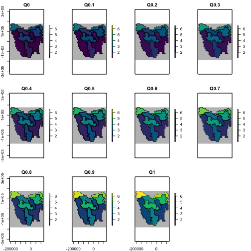
<p class="caption">plot of chunk unnamed-chunk-11</p>
</div>

\newpage

### Dispersal generator

This generator controls dispersal across our region based on mean
dispersal distance and proportion of dispersers.


``` r
# Dispersal generator ####
# Set for veriable mean distance, max hard-coded at 150
dispersal_gen <- DispersalGenerator$new(
  region = region,
  spatial_correlation = env_corr,
  generate_rasters = FALSE,
  dispersal_max_distance = 150,
  distance_classes = seq(5, 150, by = 10),
  distance_scale = 1000, # in km
  dispersal_friction = DispersalFriction$new(), # modify coastline distances
  inputs = c("dispersal_p", "dispersal_b"), # proportion and average distance
  decimals = 4
)
dispersal_gen$calculate_distance_data()
head(dispersal_gen$distance_data$base, 10)
#>     target_pop source_pop compact_row distance_class
#> X2           2          1           1              2
#> X3           3          1           2              3
#> X4           4          1           3              2
#> X5           5          1           4              2
#> X6           6          1           5              2
#> X7           7          1           6              3
#> X8           8          1           7              4
#> X9           9          1           8              5
#> X10         10          1           9              6
#> X13         13          1          10              3
table(dispersal_gen$distance_data$base$distance_class)
#> 
#>     2     3     4     5     6     7     8     9    10    11    12    13    14 
#>  5476  7790  9914 18696 15444 20798 19606 22140 29202 22426 26850 23702 28286 
#>    15 
#> 26086
```

Like with the `rmax_gen` defined above, we can test our dispersal
generator over a range of values to make sure the dispersal curve looks
appropriate. We can see in the plot below that as the proportion of
dispersal decreases, so does the maximum dispersal distance.


``` r
# plot dispersal curves for mean dispersal rates
disp_fun <- function(p, b, distance) {
  p * exp(-distance / b)
}

disp_mat <- data.frame(
  p = round(runif(1000, 5, 40) / 100, 2), # prop
  b = round(runif(1000, 5, 40)) # mean distance
)
head(disp_mat)
#>      p  b
#> 1 0.26 22
#> 2 0.07 28
#> 3 0.08 25
#> 4 0.38 23
#> 5 0.23 23
#> 6 0.19 35

disp_test <- lapply(1:nrow(disp_mat), function(i) {
  p <- disp_mat[i, "p"]
  b <- disp_mat[i, "b"]
  disp_x <- disp_fun(p, b, seq(5, 150, 5))
  return(disp_x)
})

{
  par(mar = c(4, 4, 0.5, 0.5))
  matplot(
    x = seq(5, 150, 5), y = rep(NA, 30), type = "l", ylim = c(0, 0.4),
    xlab = "Disp. dist (km)", ylab = "Prop. disp.", yaxt = "n", xaxt = "n"
  )
  axis(1, at = seq(0, 150, 10))
  axis(2, at = seq(0, 40, 5) / 100, labels = seq(0, 40, 5))
  lapply(disp_test, function(i) {
    matplot(
      x = seq(5, 150, 5), y = unlist(i), type = "l", add = TRUE,
      col = c("#C9C9C944")
    )
  })
  lines(
    x = seq(5, 150, 5),
    y = apply(as.data.frame(disp_test), 1, mean), col = "firebrick"
  )
}
```

<div class="figure" style="text-align: centre">

<p class="caption">plot of chunk unnamed-chunk-13</p>
</div>

``` r
dev.off()
#> pdf 
#>   2
```

Now that we're happy the curve follows the right form, we can generate
some dispersal data to test our population model with.


``` r
# Generate sampled dispersals for p = 0.35, b = 40 (km)
sample_dispersal_data <- dispersal_gen$generate(
  input_values = list(dispersal_p = 0.35, dispersal_b = 40)
)$dispersal_data
head(sample_dispersal_data[[1]], 10) # examine
#>     target_pop source_pop emigrant_row immigrant_row dispersal_rate
#> X2           2          1            1             1         0.0120
#> X3           3          1            2             1         0.0094
#> X4           4          1            3             1         0.0120
#> X5           5          1            4             1         0.0120
#> X6           6          1            5             1         0.0120
#> X7           7          1            6             1         0.0094
#> X8           8          1            7             1         0.0073
#> X9           9          1            8             1         0.0057
#> X10         10          1            9             1         0.0044
#> X13         13          1           10             1         0.0094
```

\newpage

### Capacity generator

Here we build a carrying capacity generator. Carrying capacity is based
on maximum density values and scaled by HS (i.e. cells with a HS of 1
contain the highest densities).

The capacity generator is set-up in such a way that it requires multiple
parameters to work.

1.`max_dens`: the maximum theoretical density of populations

2.`q_thresh`: the quantile threshold used to rescale the HS values

3.`trans_n`: the number of animals that are introduced. This value is
consistent with the `translocation` function.


``` r
capacity_gen <- Generator$new(
  description = "capacity",
  spatial_correlation = env_corr,
  generate_rasters = FALSE,
  time_steps = ncol(initial_hs),
  hs_raster = initial_hs[region$region_indices], # provide full stack of HS. Template attached
  hs_mod = tasmania_modifier[region$region_indices], # provide full stack of LULC modifier. Template attached
  int_index = int_point,
  trans_n = translocation$trans_n, # number of animals introduced
  region_indices = region$region_indices,
  inputs = c("max_dens", "q_thresh", "trans_n"),
  outputs = c("initial_abundance", "carrying_capacity"),
  generative_requirements = list(
    initial_abundance = "function",
    carrying_capacity = "function"
  )
)

capacity_gen$add_function_template(
  param = "initial_abundance",
  function_def = function(params) {
    distr_a <- params$hs_raster[, 1]
    ## 0 everywhere except the intro point at the first time step
    ## intro point to trans_n
    ## Could be above or below carrying capacity
    idx <- which(params$region_indices == params$int_index)
    distr_a[idx] <- params$trans_n
    distr_a[-idx] <- 0
    return(distr_a)
  },
  call_params = c("hs_raster", "int_index", "region_indices", "trans_n")
)

capacity_gen$add_function_template(
  "carrying_capacity",
  function_def = function(params) {
    idx <- which(params$region_indices == params$int_index)
    distr_k <- params$hs_raster
    distr_mod <- params$hs_mod
    stopifnot(
      "hs_raster and hs_mod have different number of layers" =
        dim(distr_k) == dim(distr_mod)
    )
    # stretch HS values based on q_thresh
    distr_k <- scales::rescale(distr_k, from = c(0, params$q_thresh), to = c(0, 1))
    distr_k[distr_k < 0] <- 0
    distr_k[distr_k > 1] <- 1
    # multiply thresholded HS by hs_modifier
    distr_k <- distr_k * distr_mod
    # rescale back to {0, 1}
    qMax <- max(distr_k, na.rm = TRUE)
    distr_k <- scales::rescale(distr_k, from = c(0, qMax), to = c(0, 1))
    distr_k[distr_k < 0] <- 0
    distr_k[distr_k > 1] <- 1
    # carrying capacity = (HS * maximum density)
    distr_k <- ceiling(distr_k * params$max_dens)
    distr_k[idx, 1] <- params$max_dens
    # distr_k[-idx, 1] <- 0
    return(distr_k)
  },
  call_params = c("hs_raster", "hs_mod", "int_index", "region_indices", "max_dens", "q_thresh")
)

# have all parameters been specified correctly
capacity_gen$generative_requirements_satisfied()
#> $initial_abundance
#> [1] TRUE
#> 
#> $carrying_capacity
#> [1] TRUE
```

Now we have defined our generator we can make some test data for the
model


``` r
# Generate example initial abundance and declining carrying capacity time-series
generated_k <- capacity_gen$generate(input_values = list(
  max_dens = 100, q_thresh = 0.90,
  trans_n = 60
))
example_initial_abundance <- generated_k$initial_abundance
example_carrying_capacity <- generated_k$carrying_capacity

# Plot the example initial abundance
example_initial_n_raster <- region$raster_from_values(example_initial_abundance)
example_initial_n_raster
#> class      : RasterLayer 
#> dimensions : 36, 34, 1224  (nrow, ncol, ncell)
#> resolution : 10000, 10000  (x, y)
#> extent     : -211571.8, 128428.2, -182583.2, 177416.8  (xmin, xmax, ymin, ymax)
#> crs        : +proj=laea +lat_0=-42.2 +lon_0=147 +x_0=0 +y_0=0 +datum=WGS84 +units=m +no_defs 
#> source     : memory
#> names      : layer 
#> values     : 0, 60  (min, max)
plot(example_initial_n_raster,
  main = "Example initial abundance",
  col = hcl.colors(100, "Lajolla", rev = TRUE), colNA = "grey75",
  addfun = function() {
    plot(ibra_polygons, border = "black", col = NA, add = TRUE)
  }
)
```

<div class="figure" style="text-align: centre">
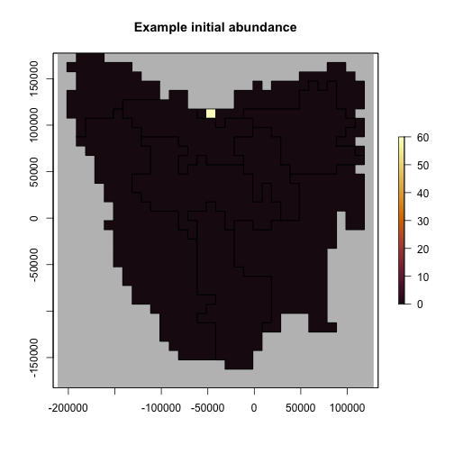
<p class="caption">plot of chunk unnamed-chunk-16</p>
</div>

``` r

# Plot the carrying capacity
## carrying capacity is forced to maximum theoretical value at first time step
example_k <- region$raster_from_values(example_carrying_capacity)
example_k[[c(1, 6, 11)]]
#> class      : RasterBrick 
#> dimensions : 36, 34, 1224, 3  (nrow, ncol, ncell, nlayers)
#> resolution : 10000, 10000  (x, y)
#> extent     : -211571.8, 128428.2, -182583.2, 177416.8  (xmin, xmax, ymin, ymax)
#> crs        : +proj=laea +lat_0=-42.2 +lon_0=147 +x_0=0 +y_0=0 +datum=WGS84 +units=m +no_defs 
#> source     : memory
#> names      : layer.1, layer.6, layer.11 
#> min values :       0,       0,        0 
#> max values :     100,      67,       99
plot(example_k,
  col = hcl.colors(100, "RdYlGn", rev = TRUE), colNA = "grey75",
  addfun = function() {
    plot(ibra_polygons, border = "black", col = NA, add = TRUE)
  },
  zlim = c(0, 100)
)
```

<div class="figure" style="text-align: centre">
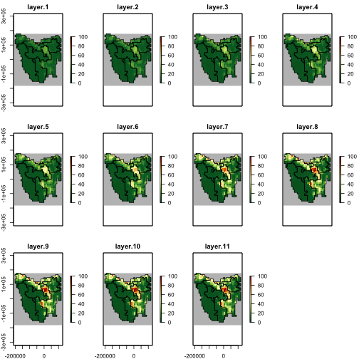
<p class="caption">plot of chunk unnamed-chunk-16</p>
</div>

\newpage

## Step 4: Build a template model

Using the generators we've built we can now test if our simple
population model works as expected.


``` r
# Template model ####
model_template <- PopulationModel$new(
  region = region,
  time_steps = 11,
  years_per_step = 1,
  stage_matrix = 1, # single-stage
  populations = region$region_cells, # 735
  demographic_stochasticity = TRUE,
  standard_deviation = 0.18,
  density_dependence = "logistic", # Ricker
  harvest = FALSE, # No harvest
  dispersal = dispersal_gen,
  translocation = translocation,
  dispersal_source_n_k = list(threshold = 0.92, cutoff = 0),
  simulation_order = c("translocation", "results", "transition", "dispersal"),
  random_seed = 20230210,
  attribute_aliases = translocation_aliases,
  results_selection = c("abundance")
)

model <- model_template$clone()
model$set_attributes(
  initial_abundance = example_initial_abundance,
  carrying_capacity = example_carrying_capacity,
  growth_rate_max = rmax_gen_ex$growth_rate_max,
  translocation = translocation,
  trans_n = 75, # passed through to translocation function
  dispersal = sample_dispersal_data
)
# run poems simulator
results <- population_simulator(model)
results$all$abundance
#>  [1]    60   461  1687  4826  6058  9342 10085 17090 13115 18711 12527

# timeseries of total abundance
plot(1:11, results$all$abundance,
  type = "l",
  xlab = "timestep", ylab = "Total abundance"
)
```

<div class="figure" style="text-align: centre">
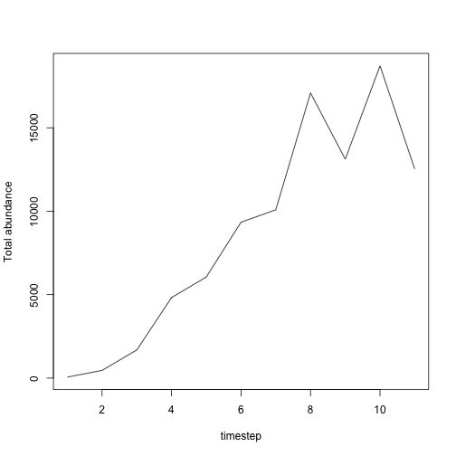
<p class="caption">plot of chunk unnamed-chunk-17</p>
</div>

The template model runs successfully and now we can make some maps of
the dispersal patterns of the populations from their initial
introduction.


``` r
abund_ras <- region$raster_from_values(results$abundance)
abund_ras[[c(1, 6, 11)]]
#> class      : RasterBrick 
#> dimensions : 36, 34, 1224, 3  (nrow, ncol, ncell, nlayers)
#> resolution : 10000, 10000  (x, y)
#> extent     : -211571.8, 128428.2, -182583.2, 177416.8  (xmin, xmax, ymin, ymax)
#> crs        : +proj=laea +lat_0=-42.2 +lon_0=147 +x_0=0 +y_0=0 +datum=WGS84 +units=m +no_defs 
#> source     : memory
#> names      : layer.1, layer.6, layer.11 
#> min values :       0,       0,        0 
#> max values :      60,     250,      345
abd_max <- round_any(max(values(abund_ras), na.rm = TRUE), 20, f = ceiling)

# plot of abundances. log(x+1) transformed.
plot(log1p(abund_ras),
  col = hcl.colors(100),
  colNA = "grey75",
  addfun = function() {
    plot(ibra_polygons, border = "black", col = NA, add = TRUE)
  },
  zlim = c(0, log1p(abd_max))
)
```

<div class="figure" style="text-align: centre">
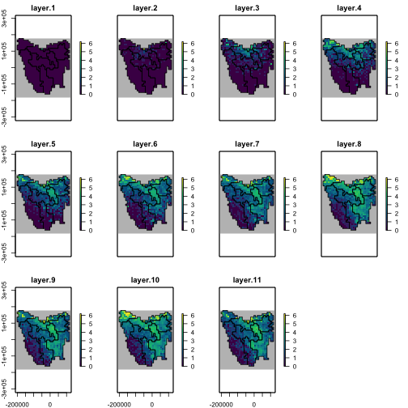
<p class="caption">plot of chunk unnamed-chunk-18</p>
</div>

To make sure our `translocation` function is working correctly, we can
run the template model again but with the `translocation` function
turned off.


``` r
model$set_attributes(
  initial_abundance = example_initial_abundance,
  carrying_capacity = example_carrying_capacity,
  growth_rate_max = rmax_gen_ex$growth_rate_max,
  translocation = NULL,
  dispersal = sample_dispersal_data
)
results_notransn <- population_simulator(model) # run poems simulator
results_notransn$all$abundance
#>  [1]    60   386  1614  4651  5532  8984  9672 15588 13801 17901 13641
results$all$abundance
#>  [1]    60   461  1687  4826  6058  9342 10085 17090 13115 18711 12527
abund_ras_notransn <- region$raster_from_values(results_notransn$abundance)
abund_ras_notransn[[c(1, 6, 11)]]
#> class      : RasterBrick 
#> dimensions : 36, 34, 1224, 3  (nrow, ncol, ncell, nlayers)
#> resolution : 10000, 10000  (x, y)
#> extent     : -211571.8, 128428.2, -182583.2, 177416.8  (xmin, xmax, ymin, ymax)
#> crs        : +proj=laea +lat_0=-42.2 +lon_0=147 +x_0=0 +y_0=0 +datum=WGS84 +units=m +no_defs 
#> source     : memory
#> names      : layer.1, layer.6, layer.11 
#> min values :       0,       0,        0 
#> max values :      60,     278,      298
diff_ras <- abund_ras - abund_ras_notransn
diff_ras[[1:2]]
#> class      : RasterBrick 
#> dimensions : 36, 34, 1224, 2  (nrow, ncol, ncell, nlayers)
#> resolution : 10000, 10000  (x, y)
#> extent     : -211571.8, 128428.2, -182583.2, 177416.8  (xmin, xmax, ymin, ymax)
#> crs        : +proj=laea +lat_0=-42.2 +lon_0=147 +x_0=0 +y_0=0 +datum=WGS84 +units=m +no_defs 
#> source     : memory
#> names      : layer.1, layer.2 
#> min values :       0,       0 
#> max values :       0,      75
```

We can see from the `diff_ras` above that the difference between
timesteps 2 of the two model runs is 75 individuals, which was the
value passed through to the `translocation` function of the original
model run.

And now we can plot the difference.


``` r
plotmax <- round_any(max(abs(values(diff_ras)), na.rm = TRUE), 10, ceiling)
plot(diff_ras[[c(1, 6, 11)]],
  zlim = c(-plotmax, plotmax),
  breaks = c(-plotmax, -100, -50, -20, 0, 20, 50, 100, plotmax),
  col = hcl.colors(9, "PuOr"),
  colNA = "grey75",
  addfun = function() {
    plot(ibra_polygons, col = NA, add = TRUE)
  }
)
```

<div class="figure" style="text-align: centre">
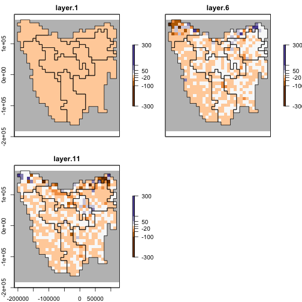
<p class="caption">plot of chunk unnamed-chunk-20</p>
</div>

\newpage

## Step 5: Run multiple simulations

In order to explore the model parameter space to find the best models,
we generate Latin hypercube samples of model and generator parameters to
be simulated, using the *LatinHypercubeSampler* class. This class has
functionality for generating sample parameters via Uniform, Normal,
Lognormal, Beta, and Triangular distributions. For our example we only
generate 10 samples. Typically however, a user would need to generate
thousands to tens of thousands, of samples.

### Define the latin-hypercube for sampling


``` r
# Latin-hypercube sampler ####
lhs_gen <- LatinHypercubeSampler$new()

# Habitat suitability threshold
lhs_gen$set_uniform_parameter("q_thresh", lower = 0.90, upper = 0.99, decimals = 2)

# Growth rate
lhs_gen$set_uniform_parameter("rmax_quantile", lower = 0, upper = 1, decimals = 2)
lhs_gen$set_uniform_parameter("standard_deviation", lower = 0.00, upper = 0.70, decimals = 2)

# Dispersal
lhs_gen$set_uniform_parameter("dispersal_p", lower = 0.05, upper = 0.40, decimals = 2)
## mean dispersal between 5 and 40 km
lhs_gen$set_uniform_parameter("dispersal_b", lower = 5, upper = 40, decimals = 0)
lhs_gen$set_uniform_parameter("dispersal_n_k_threshold", lower = 0.7, upper = 1.0, decimals = 2)

# Density max
## Density: animals/km2 needs to be scaled by grid size (10km x 10km)
## e.g. 1/km2 = (1 animal/km2 * (10*10) ) * frac_cell_used
## 1 km2 = 80 per grid cell = (1*(10*10))*0.8 # assuming 80% grid cell used
## Here I have assumed only 80% of cell is suitable. Upper/lower = 1/km - 6.25/km
lhs_gen$set_uniform_parameter("max_dens", lower = 80, upper = 500, decimals = 0)

# Translocation
lhs_gen$set_uniform_parameter("trans_n", lower = 10, upper = 100, decimals = 0)

sample_data <- lhs_gen$generate_samples(number = 10, random_seed = 42)
head(sample_data)
#>   q_thresh rmax_quantile standard_deviation dispersal_p dispersal_b
#> 1     0.97          0.72               0.31        0.21          15
#> 2     0.92          0.33               0.12        0.26           6
#> 3     0.95          0.05               0.47        0.32          21
#> 4     0.94          0.50               0.61        0.15          10
#> 5     0.98          0.85               0.39        0.38          37
#> 6     0.98          0.94               0.67        0.18          32
#>   dispersal_n_k_threshold max_dens trans_n
#> 1                    0.84      300      92
#> 2                    0.94      497      71
#> 3                    0.95      341      14
#> 4                    0.70      232      27
#> 5                    0.74      106      53
#> 6                    0.77      455      37

# Make unique row names for saving files
{
  set.seed(54612)
  sample_data$UniqueID <- paste0(
    stri_rand_strings(nrow(sample_data), 4, "[A-Z]"),
    stri_rand_strings(nrow(sample_data), 4, "[0-9]")
  )
}
sample_data <- sample_data[, c(9, 1:8)]
sample_data
#>    UniqueID q_thresh rmax_quantile standard_deviation dispersal_p dispersal_b
#> 1  GFUR0745     0.97          0.72               0.31        0.21          15
#> 2  PEZO0880     0.92          0.33               0.12        0.26           6
#> 3  NWRT4531     0.95          0.05               0.47        0.32          21
#> 4  QFAA0197     0.94          0.50               0.61        0.15          10
#> 5  TDPB8128     0.98          0.85               0.39        0.38          37
#> 6  ZWCU8467     0.98          0.94               0.67        0.18          32
#> 7  HQPY9567     0.96          0.17               0.06        0.07          28
#> 8  LROH7589     0.93          0.21               0.54        0.11          23
#> 9  CETL2983     0.91          0.58               0.22        0.26          34
#> 10 ZOXX4201     0.92          0.64               0.19        0.36          16
#>    dispersal_n_k_threshold max_dens trans_n
#> 1                     0.84      300      92
#> 2                     0.94      497      71
#> 3                     0.95      341      14
#> 4                     0.70      232      27
#> 5                     0.74      106      53
#> 6                     0.77      455      37
#> 7                     1.00      200      78
#> 8                     0.88      393      44
#> 9                     0.85      278      85
#> 10                    0.79      128      61
```

We we can run a simulation for each set (or row) of sampled parameters.
The *SimulationManager* class manages the generation of parameters (via
the generators), the running the model simulations, and writing
simulation results to disk. It also maintains a log of each simulation's
success and any errors or warnings encountered.


``` r
OUTPUT_DIR <- tempdir()
model <- model_template$clone()
model$set_attributes(params = list(
  "standard_deviation" = NULL,
  "dispersal_source_n_k$threshold" = NULL,
  "dispersal_source_n_k$cutoff" = 0.00
))

# Build the simulation manager
sim_manager <- SimulationManager$new(
  sample_data = sample_data,
  model_template = model,
  # initial_hs = initial_hs,
  generators = list(dispersal_gen, capacity_gen, rmax_gen),
  parallel_cores = 1L,
  results_filename_attributes =
    c(NULL, "UniqueID", "results"),
  results_ext = ".RDS",
  results_dir = OUTPUT_DIR
)

# Takes <10 seconds to run 10 example sims on a single core.
system.time({
  run_output <- sim_manager$run()
})
#>    user  system elapsed 
#>   3.777   0.422   4.213
run_output$summary
#> [1] "10 of 10 sample models ran and saved results successfully with warnings"
```

## Step 6: Extract results from simulations

Now that the simulations have run, we can extract the modelled
abundances. We now wish to collate summary results for each of our
simulations via the *ResultsManager* class. This manager loads the
results from each sample simulation into an intermediate
*PopulationResults* class object, which dynamically generates further
results. We need to define functions for calculating summary metrics, as
well as any matrices (one row of values per simulation) that we may be
interested in examining.

We can see from above that the `run_output$summary` shows that there
were a number of simulations that didn't complete successfully:


``` r
run_output$summary
#> [1] "10 of 10 sample models ran and saved results successfully with warnings"
```

The `run_output$full_log` shows that some simulations produced NA values
when calculating population abundances:

`"Warning: Non-finite stage abundances returned by user-defined translocation function"`

These simulations had a range of parameter values that caused the
simulation to "fall-over". These errors could be fixed by improving the
`translocation` function, or alternatively the user could discard the
simulations as being structurally wrong - i.e. that specific combination
of parameters is simply unsuitable. We're going to treat them as the
latter.

### Extract results


``` r
# Extract timeseries of abundance from each of the sims
# Load our results (list) into a PopulationResults object
p_results <- PopulationResults$new(results = run_output)
res_manager <- ResultsManager$new(
  simulation_manager = sim_manager,
  simulation_results = p_results,
  generators = NULL,
  summary_matrices = c(
    "n",
    "distr_pop"
  ),
  summary_functions = list(
    # total pop abundance
    "n" = function(sim_results) {
      sim_results$all$abundance
    },
    # matrix of abundance
    ## can be made into raster
    "distr_pop" = function(sim_results) {
      sim_results$abundance
    }
  ),
  parallel_cores = 1L
)
gen_log <- res_manager$generate()
gen_log$summary
#> [1] "10 of 10 summary metrics/matrices generated from sample results successfully"

# matrix of total population abundances
## each row is a sim, each column a timestep
res_manager$summary_matrix_list$n
#>       [,1] [,2]  [,3]  [,4]  [,5]  [,6]   [,7]  [,8]  [,9] [,10] [,11]
#>  [1,]   92 3323  7026 15041 26668 22664  41992 41696 62850 41843 59052
#>  [2,]   71 1967  2021  3882  7892 10605  20999 25497 38943 43938 47138
#>  [3,]   14  264   420  2109  6779 13228  13882 25794 24008 32783 26782
#>  [4,]   27 1364  1799  3694  7062 12462  17371 29558 24840 34150 27849
#>  [5,]   53  961  6666  8417  9409 19195  14169 30511 17347 28239    NA
#>  [6,]   37 7833 45987 31579 88186 55046 128827 97272    NA    NA    NA
#>  [7,]   78  687   388   707  1804  3405   6199 10775 12983 14604 13386
#>  [8,]   44 1024   989  3589  7830 14645  17947 29238 28654 36924 32740
#>  [9,]   85 2270  8646 15371 20338 29326  33191 52467    NA    NA    NA
#> [10,]   61  875  2541  6666  8545 12917  14238 23607 20734 22180 21780

# plot
matplot(
  x = 1:ncol(res_manager$summary_matrix_list$n),
  y = t(res_manager$summary_matrix_list$n), type = "b",
  lty = 1, xlab = "timestep", ylab = "total abundance"
)
```

<div class="figure" style="text-align: centre">
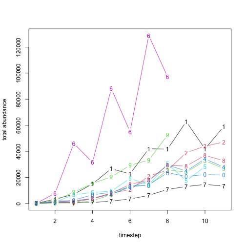
<p class="caption">plot of chunk unnamed-chunk-24</p>
</div>

From the results we can see that our `translocation` function was
working correctly, and that our `capacity_gen` was defined correctly, as
the abundances in the first time step are the same as the `trans_n`
values from our latin-hypercube samples.


``` r
identical(
  unlist(res_manager$summary_matrix_list$n[, 1]),
  unlist(sample_data$trans_n)
)
#> [1] TRUE
```

Let's assume that samples 2, 3, 4, and 8 are our "best" simulations
after some sort of validation. We have already extracted the abundances
from these simulations, so now with a few more lines of code, we can
generate averages of the simulations as rasters


``` r
best_sims <- c(2:4, 8)
dim(res_manager$summary_matrix_list$distr_pop[best_sims, ])
#> [1]    4 8085

best_abund <- matrix(
  nrow = region$region_cells,
  ncol = 11, # 11 timesteps,
  data = round(colMeans(res_manager$summary_matrix_list$distr_pop[best_sims, ]))
)

best_abund <- region$raster_from_values(best_abund)
best_abund[[c(1, 6, 11)]]
#> class      : RasterBrick 
#> dimensions : 36, 34, 1224, 3  (nrow, ncol, ncell, nlayers)
#> resolution : 10000, 10000  (x, y)
#> extent     : -211571.8, 128428.2, -182583.2, 177416.8  (xmin, xmax, ymin, ymax)
#> crs        : +proj=laea +lat_0=-42.2 +lon_0=147 +x_0=0 +y_0=0 +datum=WGS84 +units=m +no_defs 
#> source     : memory
#> names      : layer.1, layer.6, layer.11 
#> min values :       0,       0,        0 
#> max values :      39,     407,      634

abd_max <- round_any(max(values(best_abund), na.rm = TRUE),
  accuracy = 100, ceiling
)

# plot of log(x+1) abundances
plot(log1p(best_abund),
  col = hcl.colors(100, "Spectral", rev = TRUE),
  colNA = "grey75",
  addfun = function() {
    plot(ibra_polygons, border = "#000000", col = NA, add = TRUE)
  },
  zlim = c(0, log1p(abd_max))
)
```

<div class="figure" style="text-align: centre">
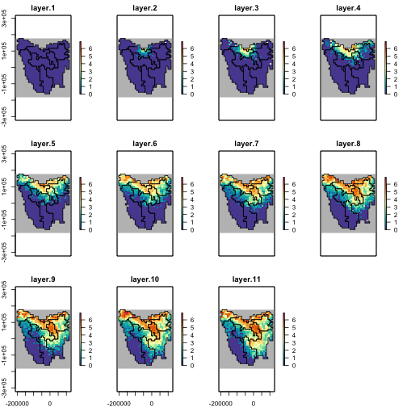
<p class="caption">plot of chunk unnamed-chunk-26</p>
</div>
